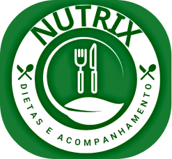

# NUTRIX   Dietas e Acompanhamento 

`Análise e Desenvolvimento de Sistemas`

`Desenvolvimento de uma aplicação Interativa`

`Segundo Semestre - Eixo 2`

 Desenvolvimento de um site que proporcionará a geração de dietas, armazenando as mesmas juntamente aos dados do usuário, permitindo acompanhar a utilização da plataforma e também sua evolução sob a aplicação das dietas, fornecendo relatórios e alertas.

### Equipe
Este projeto contou com a contribuição de:
<ul>
 <li><a href="https://github.com/Andre98B">André Barone</a></li>
 <li><a href="https://www.linkedin.com/in/philipe-rocha-0684021b2">Philipe Rocha</a></li>
 <li><a href="https://github.com/GabrieldeAlmeidaCarvalho">Gabriel de Almeida</a></li>
 <li><a href="https://github.com/RafaelPereira7L">Rafael Pereira</a></li>
 <li><a href="https://github.com/PedroVictor022">Pedro Victor</a></li>
</ul>

## Instruções de utilização

Para acessar o sistema em funcionamento, basta clicar no link abaixo:  
https://nutrix-dietas-e-acompanhamentos.azurewebsites.net/

# Documentação

<ol>
<li><a href="docs/01-Documentação de Contexto.md"> Documentação de Contexto</a></li>
<li><a href="docs/02-Especificação do Projeto.md"> Especificação do Projeto</a></li>
<li><a href="docs/03-Metodologia.md"> Metodologia</a></li>
<li><a href="docs/04-Projeto de Interface.md"> Projeto de Interface</a></li>
<li><a href="docs/05-Arquitetura da Solução.md"> Arquitetura da Solução</a></li>
<li><a href="docs/06-Template Padrão da Aplicação.md"> Template Padrão da Aplicação</a></li>
<li><a href="docs/07-Programação de Funcionalidades.md"> Programação de Funcionalidades</a></li>
<li><a href="docs/08-Plano de Testes de Software.md"> Plano de Testes de Software</a></li>
<li><a href="docs/09-Registro de Testes de Software.md"> Registro de Testes de Software</a></li>
<li><a href="docs/10-Plano de Testes de Usabilidade.md"> Plano de Testes de Usabilidade</a></li>
<li><a href="docs/11-Registro de Testes de Usabilidade.md"> Registro de Testes de Usabilidade</a></li>
<li><a href="docs/12-Apresentação do Projeto.md"> Apresentação do Projeto</a></li>
<li><a href="docs/13-Referências.md"> Referências</a></li>
</ol>

